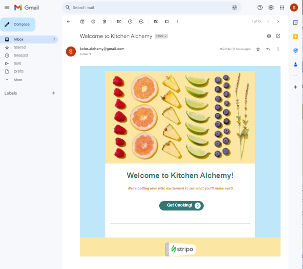

 
  # Kitchen Alchemy
  
  ## Description
 Kitchen Alchemy is an application intended to allow users to save and create recipes using a recipe database.

 ---
  
  ## Table of Contents
  * [Installation](#installation)
  * [Usage](#usage)
  * [Demo](#demo)
  * [Contributors](#contributors)
  * [Credits](#credits)
  * [License](#license)
  * [Questions](#questions)

  ---
  
  ## Installation
   No installation necessary.
  
  ---
  
  ## Usage
  * Visit the [Kitchen Alchemy](https://kitchen-alchemy.herokuapp.com/) site to login or create a new account.
  * Landing Page
  
  * Create a new account and receive a welcome email.
  
  * After logging in, you can view recipes in the feed or recipes you have created.
  * Sample Recipe
  
  * To add a new recipe, enter a Name, Description, Ingredients, and Instructions.
   

  ---
 
  ## Technologies
  This application uses the following technologies:
  * JavaScript
  * Node.js v18.12.1
  * Express
  * MySQL2
  * Sequelize
  * Environmental Variables ('dotenv')
  * Nodemailer
  * Gmail SMTP
  * Bootstrap CSS Framework

---

  ## Contributors
  "[Rebecca Roos](https://github.com/sendusyourbones)", "[Riley O'Neil](https://github.com/rileydoneil)", "[Christopher Peret](https://github.com/Zed-CSP)", "[Phuong To](https://github.com/phuongtoVN)", and "[Sarah Jensen](https://github.com/sarah-jensen)".

---

  ## Credits
  Welcome email template created using [Stripo.email](https://stripo.email/).
  
  Background images sourced from 
  https://vitalityadvocates.com/wp-content/uploads/2016/09/2-essential-ingredients.jpg
  https://www.colourbox.com/image/food-ingredients-meat-vegetables-and-spices-image-22571177
  https://photodune.net/item/flatlay-of-preparation-pastry-homemade-recipe-for-bake/20123453

  Tutorials/resources referenced:
  - Stack Overflow - [Why does using async-await in map function still return promises and not the resolved values?](https://stackoverflow.com/questions/65655885/why-does-using-async-await-in-map-function-still-return-promises-and-not-the-res)
      - This post helped with troubleshooting ingredient handling in the `/api/recipe POST` request in `/routes/api/recipeRoutes.js`
  - Go Make Things - [Converting a NodeList to an array with vanilla JavaScript](https://gomakethings.com/converting-a-nodelist-to-an-array-with-vanilla-javascript/)
      - This post helped with troubleshooting getting ingredient information in `/public/js/addRecipe.js`

---

  ## License
  This project is licensed under the MIT License - see Badge link for details.
  
  ---
  
  ## Questions
  If you have any questions or issues with the repo, please reach out to any of the [Contributors](#contributors) listed above or create an issue in the "[repo](https://github.com/Zed-CSP/codeConnoisseurs)".
